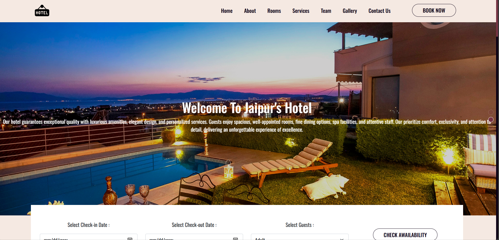

🏨 Hotel Booking Website

The Hotel Booking Website is a fully responsive web project designed using HTML, CSS, JavaScript, and Bootstrap. It allows users to explore hotels, view room details, and make bookings through an intuitive and user-friendly interface. The website features a modern design with smooth navigation, interactive forms, image sliders, and responsive layouts that adapt seamlessly to all screen sizes. Bootstrap was used to ensure consistent styling and a mobile-first approach, while JavaScript adds dynamic functionalities such as form validation, interactive elements, and user feedback. Through this project, I gained hands-on experience in frontend design, responsive web development, and user interaction handling. The Hotel Booking Website demonstrates my ability to combine aesthetics with functionality, creating a professional web interface that reflects real-world hospitality booking platforms.

  

Live Website: https://akash8955.github.io/hotel-website/

